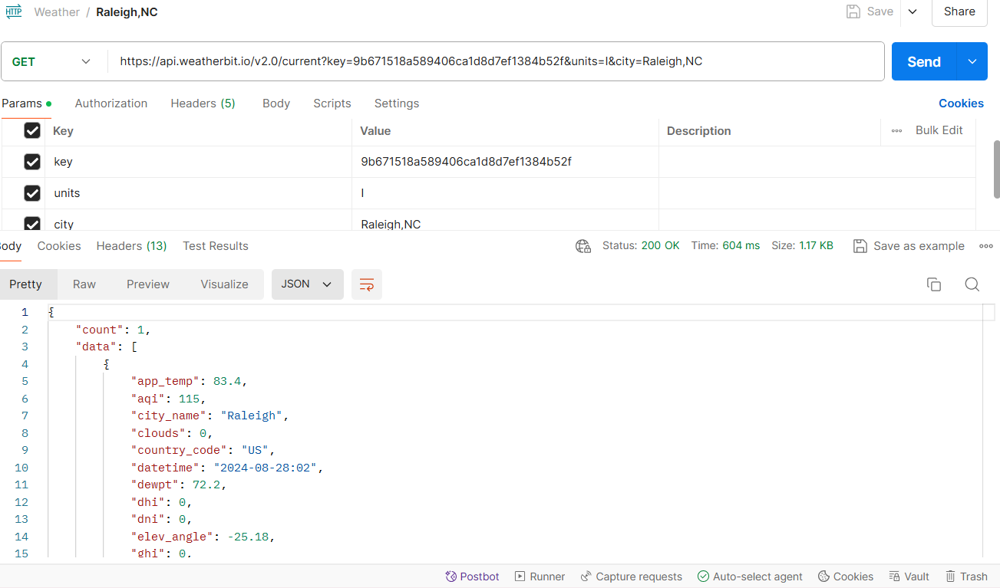
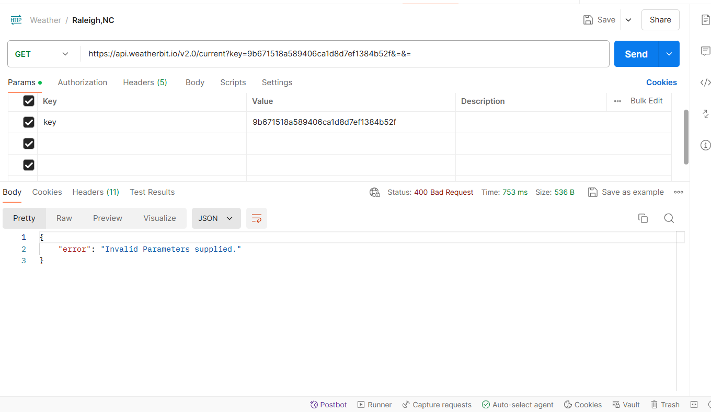

# Postman-Reflection
<h1>Pokemon</h1>
#1 
<a href= "https://pokeapi.co/api/v2/pokemon/1">Bulbasaur's</a> height is 7 and their weight is 69. Some of Bulbasaur's abilities are overgrowth and Chlorophyll ability Which can boost their speed in sunny weather.

 

#2 <a href= "https://pokeapi.co/api/v2/pokemon/200">Misdreavus's</a> height is 7 and their weight is 10. One of Misdreavus's abilities is Levitating which gives them immunity to ground moves and arena trap ability.

#3 <a href= "https://pokeapi.co/api/v2/pokemon/39" >JigglyPuff's</a> weight is 55, and their height is 5. Some of JigglyPuff's abilities are: cute-charm and being competetive which can raise a special attack by two stages upon having any stat lowered.

#4 <a href="https://pokeapi.co/api/v2/pokemon/700">Sylveon's</a> weight is 235 and their height is 10. Some of Sylveon's abilities are cute-charm and pixilating which can transform normal-type moves into fairy-type moves and boosts their power by 20%.

 

<h1>Weather</h1>

<h3><a href= "https://api.weatherbit.io/v2.0/current?key=9b671518a589406ca1d8d7ef1384b52f&units=I&city=Raleigh,NC">Raleigh,NC</a></h3>

Raleigh has a 0% chance of precip (rain) and snow for Wednesday August 28th, 2024. The current temperature is 75 degrees.

 
It is important that the keys and value go in the correct area if not the API will not execute properly. (For example if the city and units keys are missing in current weather api it will show up as invalid parameter supplies like the image below)

